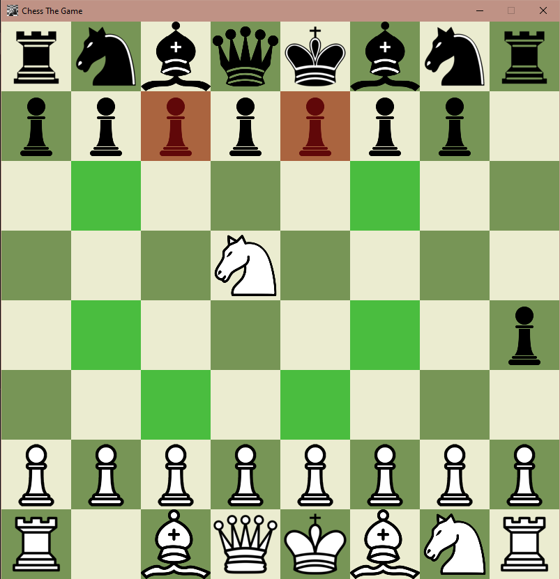

# Chess Game

# Introduction

This repository contains an initial version of a chess game with basic functionalities like checkmate, stalemate, enPassant and castling. It uses [SDL2](https://github.com/libsdl-org/SDL) and [SDL2_image](https://github.com/libsdl-org/SDL_image) for drawing and rendering the textures.

## Tools Used
- [CMake](https://cmake.org/)
- [Visual Studio](https://visualstudio.microsoft.com/)
- [bin2c](https://sourceforge.net/projects/bin2c/)

# Building the Game
- Open the project directory inside Visual Studio.
- Open the CMakelists.txt file located in the project folder and Ctrl+S. This will clone and build the dependencies.
- In case of CMake related issues, delete 'out' folder and try rebuilding.
- All the required libraries are already present (statically linked) and all the assets are taken from [PNGEGG](https://www.pngegg.com)(100x100 size).

# License
[GNU General Public License v3.0](https://www.gnu.org/licenses/gpl-3.0.en.html)
